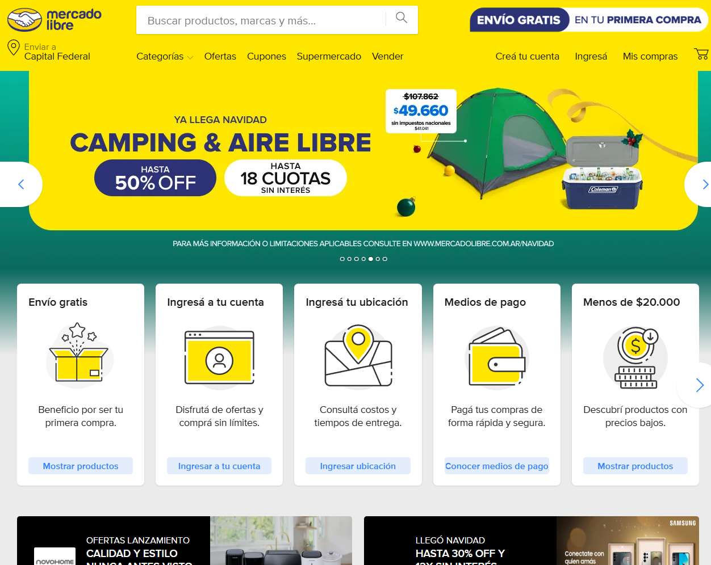

# Mercado Libre - Proyecto de Testing Manual (Web & Mobile)

**Proyecto de QA Manual** realizado como parte de mi portfolio profesional.  
Se probaron las funcionalidades principales de **Mercado Libre** en web (PC) y mobile (Android), cubriendo flujo de compra (sin realizar pagos reales).

## Objetivo
Validar funcionalmente la experiencia de usuario en Mercado Libre, identificando posibles defectos en:
- Navegación y búsqueda
- Filtros y ordenamiento
- Detalle de producto
- Carrito y checkout
- Compatibilidad y responsividad

## Alcance del Testing
- **Plataformas**: Web (Chrome, Edge) y Mobile (Android)
- **Tipos de prueba**: Funcional, usabilidad, compatibilidad, exploratorio
- **Casos ejecutados**: 50 casos de prueba manuales
- **Out of scope**: Pagos reales, publicaciones, área de vendedor, notificaciones

## Entornos Probados
| Plataforma   | Dispositivo / Navegador                  | Resolución / SO              |
|--------------|------------------------------------------|------------------------------|
| Web          | Google Chrome (última versión)           | 1280 X 800 - Windows 11      |
| Web          | Microsoft Edge                           | 1280 X 800 - Windows 11      |
| Mobile (App) | Samsung Galaxy / Emulador Android        | Android 10                   |
| Web Mobile   | Chrome DevTools (vista responsive)       | 375px (mobile view)          |

## Documentación del Proyecto

- **[Test Plan completo](docs/Test-Plan-MercadoLibre.md)** → Objetivos, alcance, criterios de aceptación y estrategia.
- **[Hoja de Casos de Prueba (Excel)](https://docs.google.com/spreadsheets/d/[ACA_PONES_EL_LINK_DE_TU_HOJA])**  
  (50 casos de prueba con ID, pasos, datos, resultado esperado/obtenido, evidencias e incidencias)
- **[Carpeta de Evidencias](/evidencias)** → Capturas y videos cortos de ejecución.
- **[Reporte de Bugs](/bugs/BUGS.md)** → Lista de defectos clasificados por severidad, pasos para reproducir y evidencias.

## Herramientas Utilizadas
- Google Chrome / Edge + DevTools
- Aplicación oficial Mercado Libre (Play Store)
- Excel (gestión de casos de prueba)
- Capturas de pantalla y grabación nativa del dispositivo
- GitHub para alojar evidencias

## Estructura del Repositorio

| Carpeta/Archivo                  | Descripción                                      |
|----------------------------------|--------------------------------------------------|
| `docs/`                          | Test Plan completo en Markdown                   |
| `evidencias/`                    | Capturas y videos de ejecución de casos          |
| `bugs/`                          | Reporte de bugs encontrados (BUGS.md + imágenes) |
| `Test-Cases-MercadoLibre.xlsx`   | Hoja de casos de prueba                          |
| `README.md`                      | Documentación principal del proyecto             |
| `LICENSE`                        | Licencia del repositorio                         |

---

**¡Gracias por visitar mi portfolio!**  
Si tenés feedback o querés charlar sobre testing, ¡dejá un comentario o contactame!

  

  
  nicolasgodoy231@gmail.com

  
  Portfolio QA

---
*Proyecto realizado en diciembre 2025 - Javier Nicolás Godoy*
